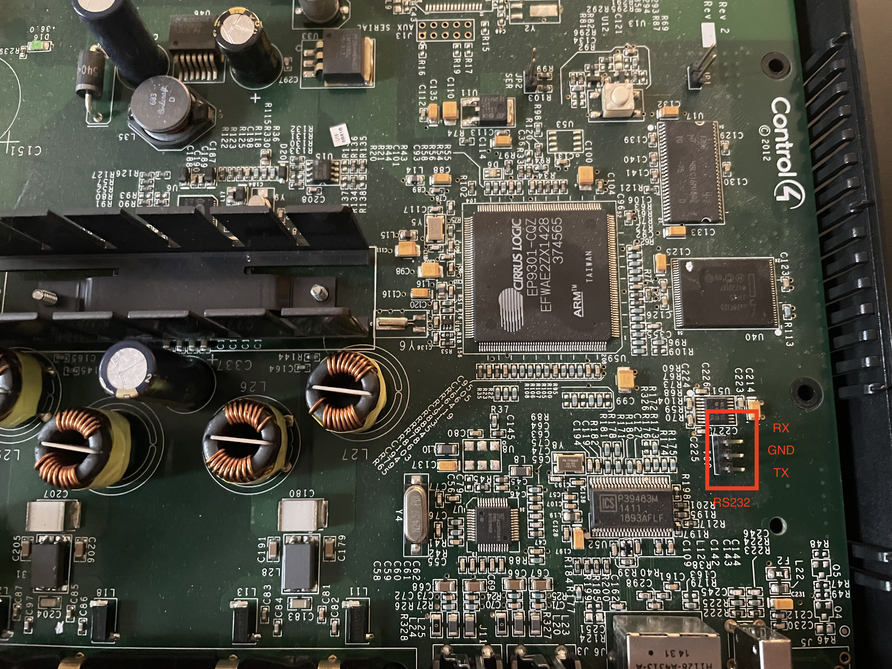

# Control4 Speakerpoint Firmware Rewrite

Custom Linux firmware for the Control4 SpeakerPoint (Cirrus EP9301), 
replacing the stock 2.4.21 kernel + cramfs userland while
keeping the stock RedBoot bootloader untouched. 

This is a work in progress. All features may not be fully functional.

## Current Implemented Features

- SSH access
- MQTT control (on the box's own mosquitto) and a React web UI that speaks it
- Speaker and RCA audio test tones, and a line-in level/frequency measurement
- USB playback, media detection and hotplug
- AirPlay 1
- Persistent install that keeps stock's bootloader, kernel and rootfs untouched
- Return to stock Control4 from the box itself (no serial cable needed)

## Planned Features

(If I can get around to it)

- Spotify Connect

## Control: MQTT

`speakerpoint-control` is a client of the box's own mosquitto (port 1883, and
websockets on 9001 for the web UI). Everything hangs off
`openspeakerpoint/<hostname>`:

| Topic | Payload |
|---|---|
| `status` | `online` / `offline` (retained; offline is the last will) |
| `state/audio/output` | `off` `rca` `amp` `both` (retained) |
| `state/audio/source` | `media` `linein` (retained) |
| `state/audio/volume` | 0-100 (retained) |
| `state/now` | now-playing JSON (retained) |
| `state/library` | `{usb, updating, rev}` - re-fetch `GET /api/library` when `rev` changes |
| `state/system/restore` | `{available, state}` |
| `cmd/audio/output` / `source` / `volume` | as above |
| `cmd/transport` | `play` `pause` `stop` `next` `prev` |
| `cmd/seek`, `cmd/play` | seconds, library index |
| `cmd/library/rescan`, `cmd/library/delete` | -, a `/media/usb` path |
| `cmd/tone` | `left` `right` `both` `stop` |
| `cmd/audio/measure` | seconds (1-10) -> `event/audio/measure` with per-channel RMS/peak dBFS and frequency |
| `cmd/system/restore` | `confirm` -> back to stock Control4 (the box reboots) |
| `error` | `{topic, message}` for a rejected command |

State is retained, events are not; scalars are bare and structured values are
JSON. HTTP (port 8081) keeps only what MQTT carries badly: `GET /api/library`,
`POST /api/upload`, `GET /api/albumart`, plus `GET /api/health` and
`GET /api/audio/status` (a hardware readback for diagnostics).

## Building

```sh
git clone <this repo>
cd control4-speakerpoint-modern
docker build --target artifacts --output type=local,dest=./output .
```

This builds everything inside Docker and exports final images to `output/images`

The image build path compiles custom apps (including `speakerpoint-control`)
as part of normal Buildroot package compilation.

## Debug Connection

The main console connection to the speakerpoint is an RS232 (not standard UART) header near the Cirrus EP9301 and right next to the MA3221C. Pin 1 is RX, pin 2 is GND, and pin 3 is TX. The baudrate is 57600.



## Testing a build (recommended: TFTP netboot, no flash writes)

After building the image, run this command on your machine to open a TFTP server for the image.

```sh
python3 -m pip install -r requirements.txt
sudo ./tftp-serve.py output/images
```

Connect the RS232 adapter as shown above and set baud to 57600. If the device is powered on already, you can press enter to start the login prompt. The credentials for Control4's stock firmware are:

```sh
root
t0talc0ntr0l4!
```

Then, once you are into the console, enter the ```reboot``` command. You can also do a standard power-cycle.

RedBoot will send a ```+``` to the console and you will have a 1 second to press ```Control-C``` to interrupt the bootloader. Once you see the ```RedBoot>``` prompt, you will then enter the following commands:

```sh
ip_address -l 10.0.0.250 -h 10.0.0.105
load -r -v -b 0x00800000 zImage.ep93xx-speakerpoint
load -r -v -b 0x01000000 rootfs.cpio.gz
exec -b 0x00800000 -l 0x1c8e60 -c "console=ttyAM0,57600" -r 0x01000000 -s 0x36a7df
```

Where ```10.0.0.250``` is an unused IP on your subnet and ```10.0.0.105``` is the IP of the TFTP server. 

After running each ```load``` command you will get an output like: ```Raw file loaded 0x01000000-0x0135893a, assumed entry at 0x01000000```. 
You need to save the second number as that is the end address of the loaded file. For the ```exec``` command you need to input the size of each image
which you can calulate by subtracting the start addresses which is ```0x00800000``` or ```0x01000000``` from the end address of the image and add one.
For example:

```0x009c8e59 - 0x00800000 + 1 = 0x1c8e60``` and ```0x0136a7de - 0x01000000 + 1 = 0x36a7df```

Then you fill those numbers after ```-l``` and ```-s``` in the ```exec``` command respectively.

Run the command and it will boot.

The credentials for this image are:

```sh
root
speakerpoint
```

## Install, back up and restore (`spflash.py`)

`spflash.py` drives RedBoot over the RS232 console (YMODEM, so no TFTP server)
and talks to the running system over SSH.

```sh
python3 -m pip install -r requirements.txt   # pyserial, paramiko

./spflash.py netboot                 # boot the built image from RAM; writes nothing
./spflash.py install                 # persistent install (below)
./spflash.py backup  --host <ip>     # dump the whole 16 MiB NOR, verified
./spflash.py restore --host <ip>     # back to stock Control4
```

YMODEM at 57600 baud runs at about 3 KiB/s, so a netboot takes ~25 minutes.

### Flash layout

The NOR is 16 MiB (128 x 128 KiB). Stock's RedBoot, kernel (`zImage`), rootfs
(`cramfs`) and FIS directory are never written - the kernel maps them
read-only. Stock's 9 MiB `jffs2.img` (Control4's `/etc`, packages and modules)
and the 256 KiB after it become:

| Partition | Size | Holds |
|---|---|---|
| `osp-kernel` | 2 MiB | the kernel |
| `osp-rootfs` | 4.375 MiB | squashfs root (`/dev/mtdblock5`) |
| `osp-restore` | 2.125 MiB | stock's jffs2 files (xz) and its RedBoot config block |
| `osp-data` | 768 KiB | jffs2 for settings and SSH host keys (`/data`) |

RedBoot's FIS directory stays stock: the boot script becomes
`fis load jffs2.img` plus an `exec` of the kernel at the start of that region.

### What `install` does

1. Netboots the image, then backs up the whole NOR to `backups/<hostname>/`
   (checked against the box's own md5; never committed).
2. Packs this unit's stock jffs2 files into `osp-restore` (read through a
   read-only jffs2 mount, compressed on the host), before anything else is
   written - so the way back exists first.
3. Writes the kernel and rootfs (each read back and verified) and formats
   `/data`.
4. Test-boots from flash by typing the boot commands at the RedBoot prompt,
   and only then saves them as RedBoot's boot script.

### Return to stock

From the web UI (Settings -> Return to stock), MQTT (`cmd/system/restore`
`confirm`), `spflash.py restore`, or `osp-restore stock --yes` on the box. It
re-creates stock's jffs2 from `osp-restore` (only zlib/rtime nodes, which
stock's 2.4 kernel reads), checks every file's md5, blanks the unallocated
space, writes stock's RedBoot config block back - which restores the stock
boot script - and reboots into Control4. All of this runs from RAM.

With a USB stick holding the raw `jffs2.bin` and `redboot-config.bin` from a
backup (and their `MD5SUMS`), `osp-restore stock --yes --raw /media/usb/<dir>`
writes them back bit for bit instead.

## Disclaimer

This is not endorsed or authroized by Control4 Corporation. Control4 is a trademark of the Control4 Corporation. 